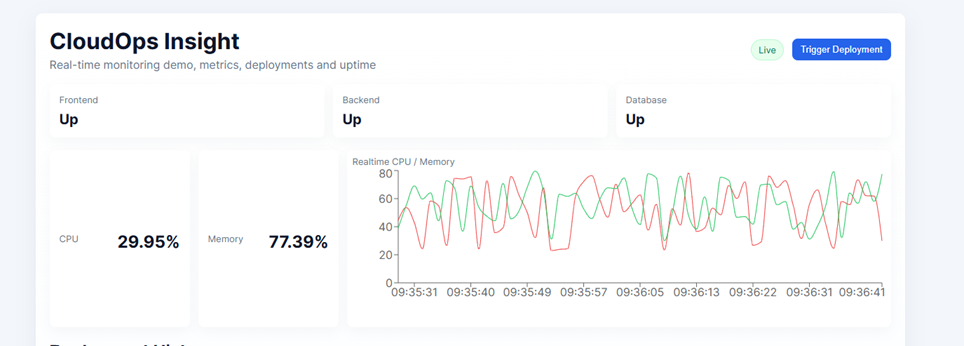
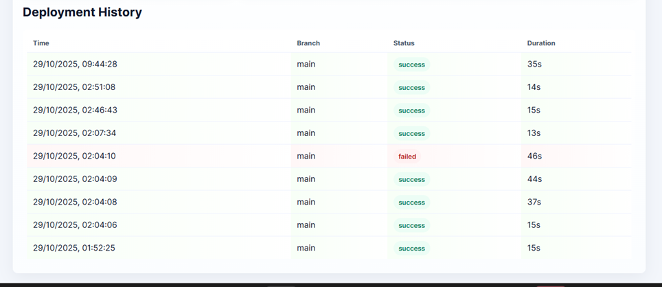
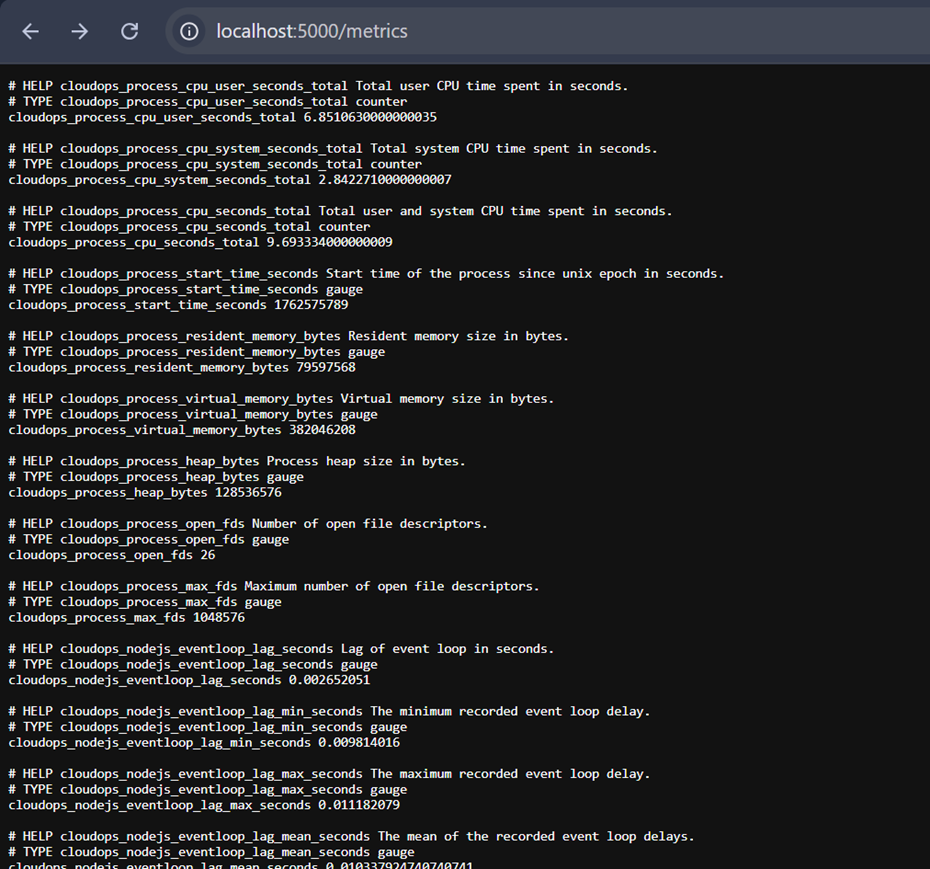
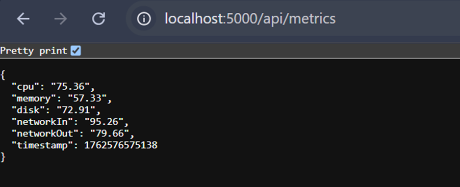
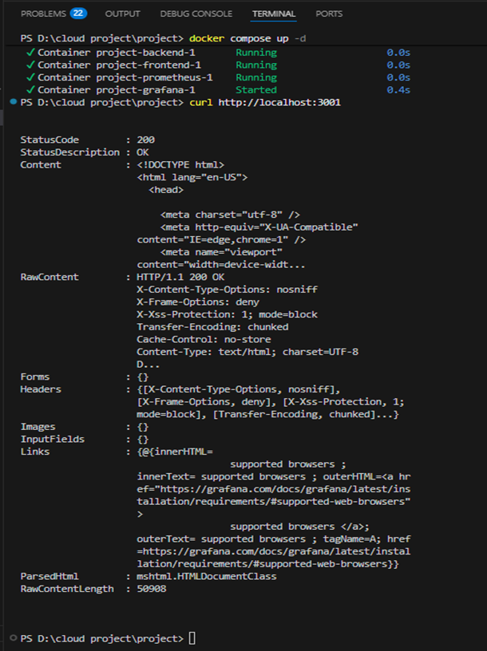
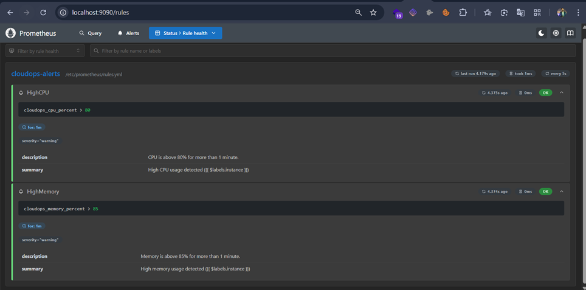
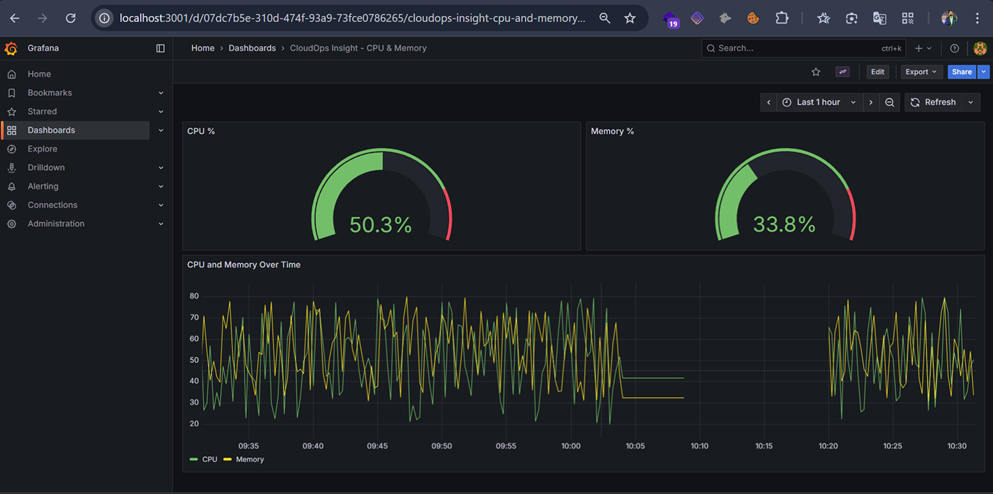
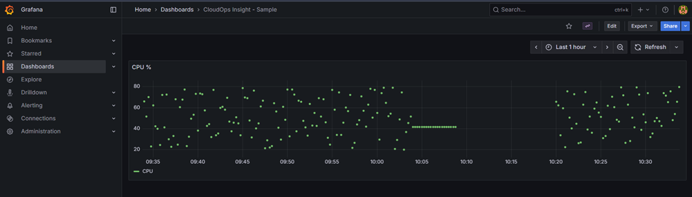
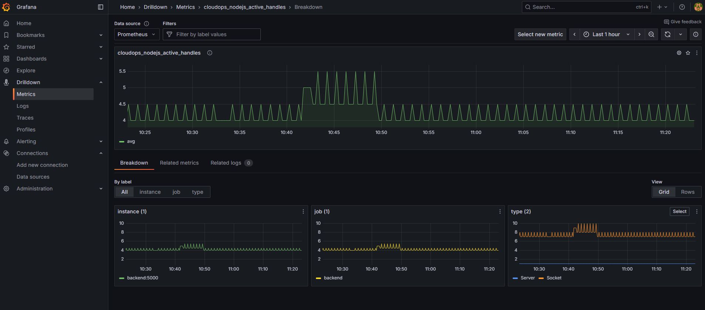
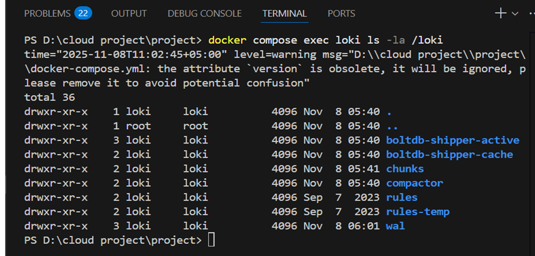

# CloudOps-Insight

**CloudOps-Insight** is a compact, student-friendly demo that illustrates a full observability pipeline, including a frontend, backend, metrics collection (Prometheus), dashboards (Grafana), alerting (Alertmanager), and log storage (Loki). It’s designed to bridge theory with practical cloud operations by simulating real-world DevOps practices in a safe, low-cost environment.


## Configured Services

| Service      | Technology            | Host Port | Notes                                                                    |
| ------------ | --------------------- | --------- | ------------------------------------------------------------------------ |
| Frontend     | React (Vite)          | 3000      | Dashboard with system health, metrics, and live updates                  |
| Backend      | Node.js + Express     | 5000      | Exposes `/metrics` for Prometheus scraping                               |
| Prometheus   | Prometheus            | 9090      | Collects metrics from backend and other services                         |
| Grafana      | Grafana               | 3001      | Pre-configured dashboards and data sources                               |
| Alertmanager | Alertmanager          | 9093      | Handles alerts from Prometheus                                           |
| Logs         | logreceiver (Windows) | 3101      | Loki stack for persistent logging via `docker-compose.loki.yml` |

The repository auto-provisions a Prometheus data source and sample dashboards into Grafana (`infra/grafana/provisioning`).


## Quick Start — Demo (Windows-friendly)

1. Start the demo stack (without Loki):

```powershell
docker compose up -d
```

2. Open services in your browser:

```powershell
Start-Process "http://localhost:3000"   # Frontend
Start-Process "http://localhost:3001"   # Grafana
Start-Process "http://localhost:9090"   # Prometheus
Start-Process "http://localhost:9093"   # Alertmanager
```

3. View logs (using the Windows demo `logreceiver`):

```powershell
docker compose logs -f logreceiver
```


## Enabling Loki (Optional, Recommended on WSL2/Linux)

Loki provides persistent log storage and integrates with Grafana.

1. Start the full observability stack with Loki:

**Option A: PowerShell convenience script**

```powershell
.\scripts\start-with-loki.ps1 -Build
```

**Option B: Docker Compose override**

```powershell
docker compose -f docker-compose.yml -f docker-compose.loki.yml up -d --build
```

Notes:

* The override defines the `loki` service and mounts a named volume (`loki_data:/loki`) for WAL, index, and chunk storage.
* Promtail is configured (`infra/promtail/config.loki.yml`) to send logs to `http://loki:3100`.
* Grafana is auto-provisioned with a Loki data source (`infra/grafana/provisioning/datasources/loki-datasource.yaml`), so dashboards and Explore queries are ready.


## Useful Commands

```powershell
# Check running containers and ports
docker compose ps

# Show Grafana logs (helpful for provisioning messages)
docker compose logs grafana --tail 200 -f

# Check Loki readiness (if enabled)
Invoke-RestMethod -Uri 'http://localhost:3100/ready' -UseBasicParsing

# Inspect Loki data on the container
docker compose exec loki sh -c "du -sh /loki || ls -la /loki"
```


## Dashboards & Datasources

Grafana provisioning is under `infra/grafana/provisioning`:

* `datasources/datasources.yaml` — Prometheus datasource (auto-provisioned)
* `datasources/loki-datasource.yaml` — Loki datasource (auto-provisioned when Loki is enabled)
* `dashboards/*.json` — Pre-built dashboards imported automatically on startup


## Testing Alerts and Metrics

* Trigger Prometheus test rules or adjust thresholds in `infra/prometheus/rules.yml`.
* Reload Prometheus inside the container:

```powershell
docker compose exec -T prometheus kill -HUP 1
```

* Check alerts via API:

```powershell
Invoke-RestMethod -Uri 'http://localhost:9090/api/v1/alerts' | ConvertTo-Json -Depth 4
```


## Architecture & Implementation

**Frontend:** React + Vite dashboards




**Backend:** Node.js + Express REST APIs





**Prometheus:** Metrics collection



**Grafana:** Dashboards & visualizations






**Loki:** Log aggregation




## Features

* Fully containerized: each service in its own Docker container
* Cloud-ready deployment with Terraform & Ansible
* Observability built-in: metrics, logs, dashboards
* CI/CD simulation with GitHub Actions
* Scalable design for additional microservices
* Security considerations: environment variables and secrets used for configuration


## Access

| Service      | URL                                            |
| ------------ | ---------------------------------------------- |
| Frontend     | [http://localhost:3000](http://localhost:3000) |
| Backend      | [http://localhost:5000](http://localhost:5000) |
| Prometheus   | [http://localhost:9090](http://localhost:9090) |
| Grafana      | [http://localhost:3001](http://localhost:3001) |
| Alertmanager | [http://localhost:9093](http://localhost:9093) |


CloudOps-Insight demonstrates **core DevOps principles** including automated deployment, monitoring, log aggregation, alerting, and observability using cloud-native technologies.