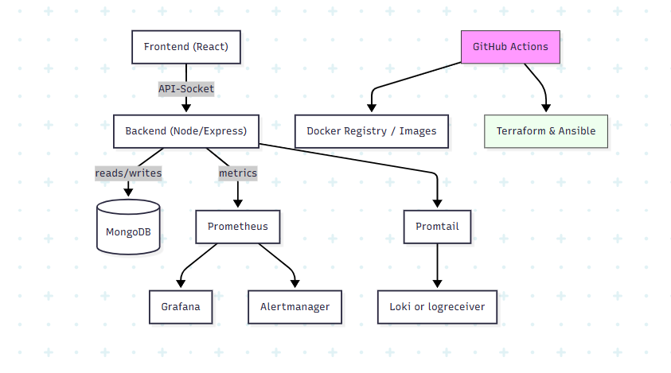

# CloudOps Insight

CloudOps Insight is a compact, student-friendly demo that shows an end-to-end deployment and observability workflow.

What it contains
- React frontend (Vite) showing health, metrics, and realtime charts
# CloudOps Insight



---

This README intentionally shows only the official architecture image. See the repository for full configs and examples.
	 - Run Loki with an alternate, single-process demo config (non-persistent) and accept that logs won't be persisted across restarts.

How to test alerts locally

1. Trigger the Prometheus test rule (or temporarily lower rule thresholds in `infra/prometheus/rules.yml`) and reload Prometheus:

```powershell
# reload Prometheus (if curl not available in container, send HUP):
docker compose exec -T prometheus kill -HUP 1

# then check alerts API
Invoke-RestMethod -Uri 'http://localhost:9090/api/v1/alerts' | ConvertTo-Json -Depth 4
```

2. Alertmanager will POST the alert JSON to the backend at `POST http://backend:5000/api/alerts` (inside docker network) which logs the payload. You can also view Alertmanager UI at http://localhost:9093.

How to enable persistent Loki storage (recommended for production/demo on Linux)

1. Create a local directory (or named volume) on a Linux host and mount it in `docker-compose.yml` under the `loki` service as `/loki`.
2. Ensure the directory is writable by the container (chown/chmod) or use a Docker named volume.
3. Restart Loki and Promtail:

```powershell
docker compose up -d loki promtail
docker compose logs loki --tail 100
```

If you want, I can attempt a non-persistent in-container Loki that avoids the WAL (demo-only) or help you set up Loki inside WSL2 where it runs reliably. Tell me which you prefer and I'll continue.

### How to start the full Loki stack (WSL2 / Linux)

If you have WSL2 or a Linux host, use the provided docker-compose override to enable Loki and persistent storage. From the project root run:

```bash
# start full stack with Loki + Promtail pushing to Loki
docker compose -f docker-compose.yml -f docker-compose.loki.yml up -d --build
```

Notes:
- The override file `docker-compose.loki.yml` mounts `infra/loki/local-config.yaml` and creates a named volume `loki_data` for persistence.
- Promtail will use `infra/promtail/config.loki.yml` (override) which points to `http://loki:3100`.

### If you are on Windows and prefer the quick demo

I replaced Loki with a lightweight `logreceiver` service for Windows local demos. It accepts Promtail's push API and prints samples to its container logs. Use the default `docker-compose.yml` (no override) to run the demo logging stack:

```powershell
docker compose up -d
docker compose logs -f logreceiver
```

This keeps the demo simple and Windows-friendly while still showing how logs flow from Promtail into a receiver.